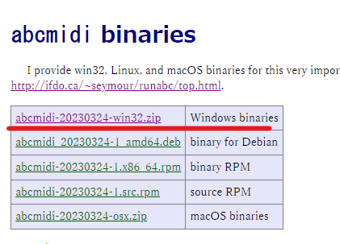

# text-to-music-webui

Windows

<!-- 
以下のものを利用します
- ffmpeg
    - https://www.ffmpeg.org/download.html
- FluidSynth
    - https://github.com/FluidSynth/fluidsynth/releases
- abcmidi
    - [github](https://github.com/sshlien/abcmidi)
    - [オリジナル](https://abc.sourceforge.net/abcMIDI/original/)
    - [DLサイト](https://abcplus.sourceforge.net/#abcmidi)
    - [インストール方法](https://mahoroba.logical-arts.jp/archives/1865)
-->

## setting

### ffmpeg

[DLサイト](https://github.com/BtbN/FFmpeg-Builds/releases)以下のものをダウンロードしてください
- ffmpeg-master-latest-win64-gpl-shared.zip

解凍したZIPファイル内のファイルを`ffmpegフォルダ`すべて移動させます。

以下のように構成してください
```
text-to-music-webui-main
├─ffmpeg
│  └─bin
│      avcodec-60.dll
│      avdevice-60.dll
│      avfilter-9.dll
│      avformat-60.dll
│      avutil-58.dll
│      ffmpeg.exe
│      ffplay.exe
│      ffprobe.exe
│      postproc-57.dll
│      swresample-4.dll
│      swscale-7.dll
```

---

### FluidSynth

[DLサイト](https://github.com/FluidSynth/fluidsynth/releases)からダウンロードしてください。

解凍したZIPファイル内のファイルを`fluidsynthフォルダ`すべて移動させます。

以下のように構成してください
```
text-to-music-webui-main
├─fluidsynth
│  └─bin
│      fluidsynth.exe
│      libfluidsynth-3.dll
│      libgcc_s_sjlj-1.dll
│      libglib-2.0-0.dll
│      libgobject-2.0-0.dll
│      libgomp-1.dll
│      libgthread-2.0-0.dll
│      libinstpatch-2.dll
│      libinstpatch-2.pdb
│      libintl-8.dll
│      libsndfile-1.dll
│      libstdc++-6.dll
│      libwinpthread-1.dll
```

---


### abcmidi

すでに入っているのでダウンロードは必要ない

動かなければ[DLサイト](https://abcplus.sourceforge.net/#abcmidi)から画像の赤ラインのzipファイルをインストールをしてください。



解凍したZIPファイル内のファイルを`abc2midiフォルダ`に移動させます。

```
text-to-music-webui-main
├─abc2midi
│      abc2midi.exe
```

---


### soundfont

soundfontがないと音がならないのでインストールしてください
[SGM-V2.01.sf2](https://ja.osdn.net/projects/sfnet_androidframe/downloads/soundfonts/SGM-V2.01.sf2/)

置く場所は'soundFont'フォルダにおいてください

---

### 環境

仮想環境の作成
```bash
$ py -m venv .venv
```

アクティベート
```bash
$ .venv\Scripts\activate
```

仮想環境のアップデート
```bash
(.venv)$ pip install -U pip setuptools
```

PC環境にあった`PyTorch`のインストール
https://pytorch.org/
```bash
# CPU
pip install torch torchvision torchaudio

# GPU-CUDA 11.8
pip3 install torch torchvision torchaudio --index-url https://download.pytorch.org/whl/cu118

# GPU-CUDA 11.7
pip3 install torch torchvision torchaudio --index-url https://download.pytorch.org/whl/cu117
```

仮想環境にライブラリのインストール
```bash
(.venv)$ pip install -r requirements.txt
```

<!--
ファイル実行がでるようにbatファイルを作成
環境も一緒にできればなおよし
-->

